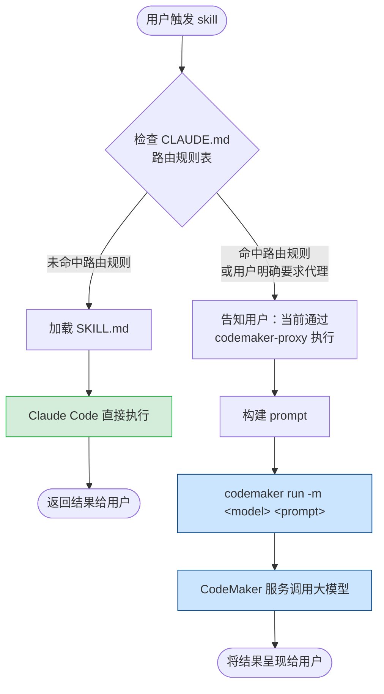

# CodeMaker Proxy

## 背景

### 为什么需要 CodeMaker Proxy？

团队有 CodeMaker token 使用量的统计需求，需要扩大 CodeMaker 的使用场景。CodeMaker 推出了 CLI 工具，支持通过命令行方式调用大模型，因此封装了 **codemaker-proxy** skill，并支持将部分 skill 的执行路由到 codemaker-proxy 代理。

### 它解决了什么问题？

1. **Token 统计归因**：通过 codemaker cli 执行的调用，会计入 CodeMaker 统计口径，满足团队 token 使用量可观测的需求。
2. **claudecode 降级备选**：当 Claude Code 本身遇到 API 连接异常、模型调用出错等问题时，codemaker-proxy 可作为临时替代方案，继续完成任务。
3. **多模型灵活切换**：通过 `-m` 参数，可以在 Claude、GPT、Kimi 等不同模型间自由切换，探索不同模型对同一任务的回答差异。

---

## 工作原理

codemaker-proxy 的核心是将问题通过 `codemaker run` 命令转发给远端大模型，再将结果呈现给用户。


---

## 两种执行路径的对比



| | 直接执行 | 代理执行 |
|--|---------|---------|
| Token 统计 | Claude Code 配额 | CodeMaker 统计 |
| 模型切换 | 固定 | 支持多模型 |
| API 依赖 | Claude Code API | CodeMaker CLI |
| 执行速度 | 快 | 略慢（CLI 启动开销）|

---

## 代理执行的使用场景

### 场景一：CLAUDE.md 路由规则配置的 skill

在 `CLAUDE.md` 的「Skill 执行路由规则」表中登记的 skill，**会被强制路由到 codemaker-proxy 执行**，Claude Code 不会直接执行原 skill 流程。

当前已配置的路由规则（见 `CLAUDE.md`）：

| Skill | 触发场景 | 代理执行的操作 |
|-------|---------|--------------|
| `docs-search` | 查看/搜索项目文档 | 让 codemaker 在项目目录搜索并返回文档内容或路径 |
| `change-app-version` | 修改 APP 版本号 | 让 codemaker 修改 `gradlescript/gl_config.gradle` |
| `popo-doc-exporter` | POPO 文档链接 | 让 codemaker 调用导出脚本并展示内容 |
| `app-config-generator` | 添加/修改 APP 配置项 | 让 codemaker 生成配置相关代码 |
| `abtest-generator` | CMS AB 测试代码生成 | 让 codemaker 生成 ABTestEntityV2 相关代码 |
| `abtestv2-generator` | 达尔文 AB 测试代码生成 | 让 codemaker 生成 ABTestV2 相关代码 |
| `api-mock-generator` | 生成 Proto 接口 mock 数据 | 让 codemaker 根据 Proto 类生成 mock JSON（可附加文件） |
| `create-proto` | 根据接口文档创建 Proto 类 | 让 codemaker 生成继承 GLBaseProto 的 Proto 类（可附加文件） |

**执行示例**（以 `docs-search` 为例）：

用户说：「查一下 IM 模块的文档」

→ Claude Code 识别到 `docs-search` skill 命中路由规则

→ 输出提示：
> 当前任务将通过 **codemaker-proxy** 代理执行（由 CLAUDE.md 路由规则指定）。如不希望代理，可在 `CLAUDE.md` 的「Skill 执行路由规则」中移除对应条目。

→ 执行：`codemaker run -m "netease-codemaker/claude-sonnet-4-6" "在项目目录下搜索 IM 模块相关文档，返回文档路径和摘要"`

---

### 场景二：用户主动要求使用 codemaker

用户可以随时说「用 codemaker 问一下」、「让 codemaker 看看」等，直接触发 codemaker-proxy skill，将当前问题或任务转发给 codemaker 执行。

**执行示例**：

用户说：「用 codemaker 问一下这段代码有没有性能问题」

→ 触发 codemaker-proxy skill

→ 选择合适模型（默认 `claude-sonnet-4-6`，或根据用户指定）

→ 执行：`codemaker run -m "netease-codemaker/claude-sonnet-4-6" -f path/to/file "分析这段代码是否存在性能问题"`

---

### 场景三：Claude Code 不可用时的降级

当 Claude Code 出现 API 连接错误、模型响应超时等问题时，可临时改用 codemaker-proxy 完成任务：

**执行示例**：

遇到 API 报错 → 用户说「用 codemaker 继续刚才的任务」

→ codemaker-proxy 接管，继续执行

---

### 场景四：对比不同模型的回答

codemaker-proxy 支持指定多个模型，适合在同一问题上对比不同模型的输出质量：

```bash
# 用 Claude Opus 获取最强推理能力
codemaker run -m "netease-codemaker/claude-opus-4-6" "设计一个高并发消息队列方案"

# 用 Kimi 降低 token 消耗
codemaker run -m "netease-codemaker/kimi-k2.5" "帮我写一个工具方法的单元测试"

# 用 GPT-5 获取编码建议
codemaker run -m "netease-codemaker/gpt-5.2-codex-2026-01-14" "重构这段 Kotlin 协程代码"
```

---

## 如何为新 skill 启用代理执行

### 方式一：创建 skill 时询问（推荐）

使用 `skill-creator` 创建新 skill 时，会在 **Step 1.5** 询问是否通过 codemaker-proxy 代理执行。选择「是」后，会自动在 `CLAUDE.md` 的路由规则表中新增对应条目。

### 方式二：手动编辑 CLAUDE.md

在 `CLAUDE.md` 的「Skill 执行路由规则」表中新增一行：

```markdown
| `skill-name` | 触发场景描述 | 将任务描述作为 prompt，使用 `codemaker run -m "netease-codemaker/claude-sonnet-4-6" "<prompt>"` 执行 |
```

### 取消代理执行

从 `CLAUDE.md` 的路由规则表中删除对应行即可，之后该 skill 将恢复直接执行。

---


## 安装与登录

首次使用codemaker-proxy skill会自动安装，如果未安装可手动执行以下命令

**安装 codemaker cli**：

```bash
curl -fsSL https://codemaker.netease.com/package/codemaker-cli/install | bash
```

**登录**（首次使用或 token 过期时）：

```bash
codemaker
# 在交互式界面中执行 /login
```

**验证安装**：

```bash
codemaker --version
```
